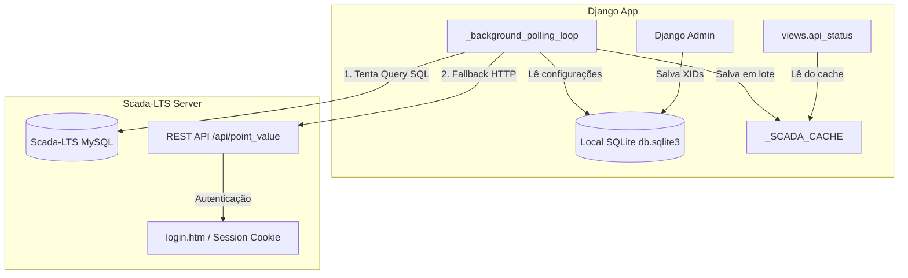
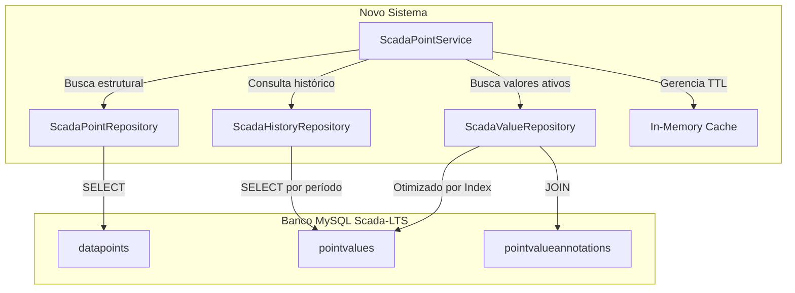
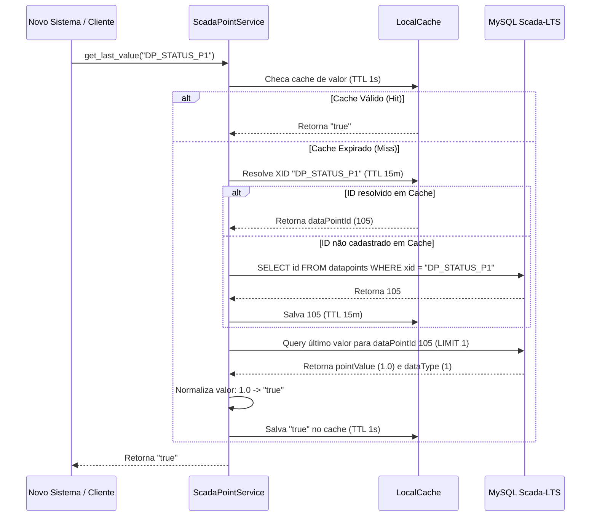
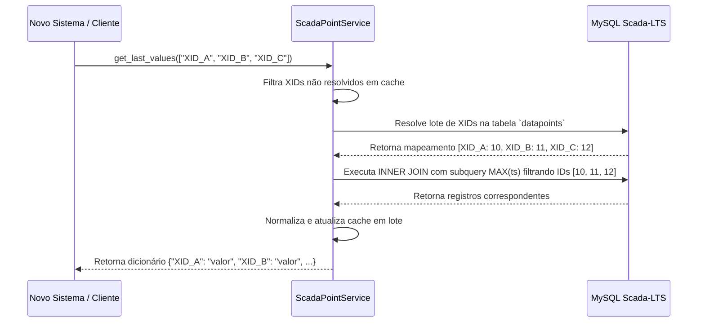
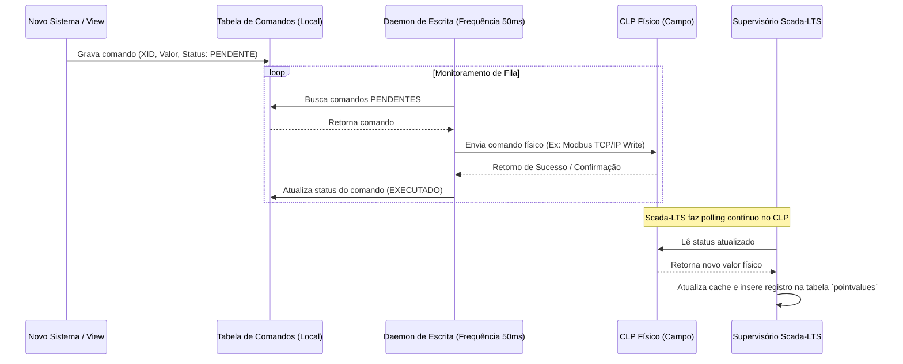

# Documentação Técnica: Integração MySQL entre Painel Sinóptico e Scada-LTS

Esta documentação detalha a arquitetura atual do sistema **Painel Sinóptico / Monitor de Prensas**, o modelo de dados do **Scada-LTS** baseado no backup `backup_scadalts.sql`, e fornece uma proposta completa para uma integração direta e otimizada via MySQL, eliminando o uso de chamadas HTTP REST legadas.

---

## Parte 1 — Analisar o Projeto Django Atual

O sistema atual do Painel Sinóptico funciona coletando em lote ou individualmente as variáveis registradas sob identificadores conhecidos como **XIDs** (External Identifiers) diretamente da base de dados ou do fallback de API do Scada-LTS, preparando esses dados no backend Django e servindo-os para consumo de um painel de monitoramento web otimizado para TVs industriais.

### 1. Estrutura Geral do Sistema

O projeto Django é composto principalmente pelos seguintes módulos e divisões de responsabilidade:

* **Nome do App Django principal**: `dashboard`
* **Models**: Definidos no arquivo [models.py](file:///c:/Users/Unicompo/Documents/03_PYTHON1/05%20-%20PAINEL%20SINOTIPO/dashboard/models.py). Armazenam a estrutura física das prensas cadastradas, alarmes globais, parâmetros de telemetria, configurações de conexão e a tabela de valores simulados (mock).
* **Views**: Definidas no arquivo [views.py](file:///c:/Users/Unicompo/Documents/03_PYTHON1/05%20-%20PAINEL%20SINOTIPO/dashboard/views.py). Controlam a exibição do painel principal, painel do simulador e as APIs JSON para comunicação em tempo real.
* **Serviços/Acesso a Dados**: Implementados em [scadalts_reader.py](file:///c:/Users/Unicompo/Documents/03_PYTHON1/05%20-%20PAINEL%20SINOTIPO/dashboard/services/scadalts_reader.py). Concentram as queries SQL diretas no MySQL secundário do Scada-LTS e gerenciam a autenticação e chamadas na REST API quando necessário.
* **Loops e Workers de Segundo Plano**: Localizados em [scada_connector.py](file:///c:/Users/Unicompo/Documents/03_PYTHON1/05%20-%20PAINEL%20SINOTIPO/dashboard/scada_connector.py). Contêm um loop contínuo de polling (`_background_polling_loop`) executado por uma Thread dedicada (`ScadaLTSBackgroundPolling`) disparada na inicialização do servidor Django. Este loop busca valores em lote e atualiza um cache em memória global (`_SCADA_CACHE`).
* **Mapeamento e Controle Concorrente**: Um arquivo físico de controle cross-process chamado `scada_collector.lock` é criado/gerido via classe [ProcessLock](file:///c:/Users/Unicompo/Documents/03_PYTHON1/05%20-%20PAINEL%20SINOTIPO/dashboard/scada_connector.py#L17) para assegurar que apenas um worker execute a thread de polling concorrentemente.
* **Configuração da Conexão**: Localizada no arquivo [settings.py](file:///c:/Users/Unicompo/Documents/03_PYTHON1/05%20-%20PAINEL%20SINOTIPO/painel_sinotico/settings.py). Define o roteamento para a conexão primária do Django (SQLite `db.sqlite3` local) e a conexão secundária somente leitura para o MySQL (`scadalts_readonly`).

---

### 2. Cadastro dos XIDs no `/admin`

O gerenciamento dos datapoints de interesse do chão de fábrica (temperaturas, alarmes, status de prensas) é feito por meio de cadastros de **XIDs** no painel administrativo do Django. 

Os models responsáveis são mapeados da seguinte forma:

#### A) Model `Press` (Tabela Django: `dashboard_press`)
Representa cada prensa hidráulica monitorada na linha de vulcanização.
* `name`: `CharField(max_length=50)` — Nome legível da Prensa (Ex: "PRENSA 01").
* `xid_status`: `CharField(max_length=50)` — Código XID para o status lógico (Produzindo/Parada).
* `xid_abertura`: `CharField(max_length=50)` — Código XID para o sensor de abertura (Prensa abrindo/ciclo concluído).
* `xid_motivo_geral`: `CharField(max_length=50)` — Código XID para motivo geral de parada.
* `cavities_count`: `IntegerField(choices=[(2, '2 Cavidades'), (4, '4 Cavidades')])` — Quantidade de moldes/cavidades ativos.
* `name_cav1` a `name_cav4`: `CharField(max_length=50)` — Rótulo descritivo de cada cavidade.
* `xid_motivo_cav1` a `xid_motivo_cav4`: `CharField(max_length=50, blank=True)` — XIDs que transmitem os códigos numéricos de motivos de parada específicos de cada cavidade.
* `xid_prod_cav1` a `xid_prod_cav4`: `CharField(max_length=50, blank=True)` — XIDs para os contadores de produção atual de cada cavidade.
* `meta_prod_cav1` a `meta_prod_cav4`: `IntegerField` — Meta numérica de produção para cada cavidade.
* `last_production_stop`: `DateTimeField(null=True, blank=True)` — Armazena o instante exato em que o sinal de produção foi a zero (calcula o cronômetro de parada).
* `is_alarm_only`: `BooleanField` — Flag indicando se a prensa serve apenas para telemetria no topo, ocultando seu card principal.
* `order`: `IntegerField` — Ordem relativa de ordenação dos cards no painel sinóptico.

#### B) Model `GlobalAlarm` (Tabela Django: `dashboard_globalalarm`)
Representa variáveis de segurança de infraestrutura do setor (Ex: Pressão de Vácuo Geral, Vapor, Ar Comprimido).
* `name`: `CharField(max_length=50)` — Nome amigável do sensor.
* `alarm_type`: `CharField(max_length=20, unique=True)` — Tipagem interna (`vacuum`, `steam`, `pneumatic`).
* `xid_alarm`: `CharField(max_length=50)` — XID do alarme ativo no Scada-LTS.

#### C) Model `GlobalParameter` (Tabela Django: `dashboard_globalparameter`)
Armazena a parametrização dos medidores de topo para exibição analógica em tempo real.
* `name`: `CharField(max_length=50)` — Nome descritivo (Ex: "Vácuo", "Vapor P1-P7").
* `param_type`: `CharField(max_length=30, unique=True)` — Tipagem interna (`vacuum_press`, `steam_1_7`, `steam_8_12`, `pneumatic_press`).
* `xid_param`: `CharField(max_length=50)` — XID que recebe a telemetria numérica da rede industrial.
* `unit`: `CharField(max_length=10)` — Unidade física correspondente (Ex: `bar`, `mmHg`).

#### D) Interface Administrativa (`admin.py`)
No `/admin/`, os XIDs e variáveis são exibidos organizados por seções lógicas no model admin [PressAdmin](file:///c:/Users/Unicompo/Documents/03_PYTHON1/05%20-%20PAINEL%20SINOTIPO/dashboard/admin.py#L9) através de `fieldsets`:
* **Identificação**: Nome, ordem de exibição, visibilidade.
* **Status Geral**: XIDs gerais de status, abertura, motivo de parada global e campo de data da última parada.
* **Cavidades**: Configuração da quantidade e nomes.
* **Motivos de Parada**: XIDs específicos das cavidades de 1 a 4.
* **Produção e Metas**: XIDs de contadores físicos e limites de meta por cavidade.

---

### 3. Fluxo Atual de Leitura

O sistema atual de polling e cache segue a seguinte mecânica lógica de aquisição e conversão de valores:

```
Cadastro no /admin
      ↓
Model Django (SQLite)
      ↓
ScadaLTSConnector (Thread de Polling em Backgroud)
      ↓
Coleta de todos os XIDs ativos
      ↓
Consulta Direta MySQL (Single Batch Query)
      ↓
[Falha de Rede / Erro DB] ──► Fallback: REST API (Login htm + Session HTTP)
      ↓
Normalização e Conversão dos Tipos (String, Int, Boolean)
      ↓
Cache em Memória Local (Global _SCADA_CACHE com TTL expirável)
      ↓
AJAX /api/status (View Django puxa do cache a cada 1.5s)
      ↓
Renderização e Atualização Visual da Tela da TV (Frontend)
```

#### Mecanismos de Robustez, Cache e Fallback
1. **Cache Local**: Os valores decodificados do MySQL são guardados na memória RAM do worker Django através do dicionário global `_SCADA_CACHE` com validade configurável (definida por `SCADA_VALUE_CACHE_TTL`, padrão `1.0` segundos). Os mapeamentos de `XID -> ID Interno` do Scada-LTS são armazenados em `_XID_TO_DP_ID_CACHE` por até `15 minutos` (`SCADA_XID_CACHE_TTL = 900s`).
2. **Tratamento de XID Inválido**: XIDs não encontrados no MySQL são inseridos no `_FAILED_XID_CACHE` com tempo de expiração de `10 segundos` para evitar consultas redundantes e desnecessárias à base.
3. **Mecanismo de Fallback REST**: Se a conexão MySQL falhar, o sistema ativa uma máquina de estado REST baseada em classe [ScadaSessionManager](file:///c:/Users/Unicompo/Documents/03_PYTHON1/05%20-%20PAINEL%20SINOTIPO/dashboard/services/scadalts_reader.py#L88):
   * **Login Automático**: Acessa `/login.htm` via POST para restaurar a sessão se detectar redirecionamento.
   * **Limitação de Rate limit**: Permite no máximo 5 tentativas de login a cada 10 minutos com intervalo mínimo de 60 segundos entre elas.
   * **Disjuntor (Circuit Breaker)**: Se ocorrerem 3 falhas consecutivas de conexão física ou de credenciais na API REST, o disjuntor desarma, bloqueando totalmente o tráfego REST por 5 minutos para preservar recursos do servidor.

---

## Parte 2 — Analisar o backup_scadalts.sql

A partir da leitura estática do arquivo `backup_scadalts.sql`, identificamos a estrutura física, tabelas, relacionamentos e tipos nativos de representação de dados do Scada-LTS.

### 4. Tabelas Principais

As tabelas de maior relevância mapeadas no backup são descritas a seguir:

#### A) Tabela `datapoints`
Armazena as definições cadastrais de cada variável/sensor físico.
* **Campos principais**:
  * `id` (`int NOT NULL AUTO_INCREMENT`): ID sequencial interno do datapoint. Chave primária.
  * `xid` (`varchar(50) NOT NULL`): Identificador externo único amigável (Ex: "DP_STATUS_P1"). Chave única.
  * `dataSourceId` (`int NOT NULL`): ID do DataSource ao qual o ponto pertence. FK para `datasources(id)`.
  * `pointName` (`varchar(250)`): Nome físico do sensor.
  * `plcAlarmLevel` (`tinyint`): Define níveis específicos de alarme associados ao ponto.
  * `data` (`longblob NOT NULL`): Configurações complexas e metadados estruturais serializados em formato binário (Java Serialization).

#### B) Tabela `pointvalues`
Armazena a série temporal histórica de leituras enviadas pelos PLCs para o Scada-LTS.
* **Campos principais**:
  * `id` (`bigint NOT NULL AUTO_INCREMENT`): ID de log. Chave primária.
  * `dataPointId` (`int NOT NULL`): FK para `datapoints(id)`.
  * `dataType` (`int NOT NULL`): Identificador do tipo físico da variável (Binary, Numeric, etc).
  * `pointValue` (`double DEFAULT NULL`): Valor em formato de ponto flutuante de dupla precisão (usado para dados numéricos, booleanos e inteiros).
  * `ts` (`bigint NOT NULL`): Timestamp da leitura em Unix epoch milissegundos.
* **Índices físicos de performance**:
  * `pointValuesIdx1` (`ts`, `dataPointId`)
  * `pointValuesIdx2` (`dataPointId`, `ts`): **Crítico para performance**, pois permite localizar de forma indexada o registro com o maior `ts` para um determinado `dataPointId`.

#### C) Tabela `pointvalueannotations`
Armazena o conteúdo textual ou strings de variáveis que não cabem no campo numérico `pointValue`.
* **Campos principais**:
  * `pointValueId` (`bigint NOT NULL`): Chave estrangeira que referencia `pointvalues(id)`.
  * `textPointValueShort` (`varchar(128)`): Armazena strings curtas e dados alfanuméricos normais.
  * `textPointValueLong` (`longtext`): Armazena grandes volumes de texto, como strings JSON complexas.

#### D) Tabela `events`
Guarda o log de auditoria, conexões e alarmes disparados no sistema de supervisão.
* **Campos principais**:
  * `id` (`int NOT NULL AUTO_INCREMENT`): Chave primária.
  * `typeId` (`int NOT NULL`): Tipo de origem do alarme (`1` para alarmes vinculados a Data Points).
  * `typeRef1` (`int NOT NULL`): Referência da origem física (quando `typeId = 1`, armazena o `dataPointId` correspondente).
  * `activeTs` (`bigint NOT NULL`): Instante de ativação do evento (Unix epoch milissegundos).
  * `rtnTs` (`bigint DEFAULT NULL`): Instante de normalização/retorno (Return to Normal).
  * `alarmLevel` (`int NOT NULL`): Nível de gravidade do alarme.
  * `message` (`longtext`): Mensagem legível gerada pelo sistema.

#### E) Tabela `users`
Controle de usuários cadastrados no Scada-LTS.
* **Campos principais**:
  * `id` (`int NOT NULL AUTO_INCREMENT`): ID único.
  * `username` (`varchar(40) NOT NULL`): Nome de login do operador.
  * `password` (`varchar(30) NOT NULL`): Senha de acesso.
  * `email` (`varchar(255) NOT NULL`): Endereço eletrônico.
  * `admin` (`char(1) NOT NULL`): Flag de privilégios administrativos (`Y`/`N`).
  * `disabled` (`char(1) NOT NULL`): Status de suspensão (`Y`/`N`).

---

### 5. Localização do Datapoint pelo XID

Para realizar a tradução lógica do XID configurado no Painel Admin do Django para o valor em tempo real na base MySQL do Scada-LTS, a navegação de chaves ocorre conforme o seguinte fluxo:

```
  XID Cadastrado ("DP_STATUS_P1")
                ↓
  Tabela `datapoints` (Filtra por coluna `xid`)
                ↓
  Obtém `datapoints.id` (ID Interno, Ex: 105)
                ↓
  Tabela `pointvalues` (Filtra por `dataPointId = 105`)
                ↓
  Obtém o registro com o maior `ts` (Timestamp mais recente)
                ↓
  [Se dataType == 4] ──► Faz JOIN com `pointvalueannotations` no ID obtido
                ↓
  Valor Atual Exibido
```

#### SQL Modelo de Tradução de XID para ID Interno
```sql
SELECT id AS datapoint_id, pointName, dataSourceId
FROM datapoints
WHERE xid = 'DP_STATUS_P1';
```

---

### 6. Leitura do Último Valor

O Scada-LTS **não** armazena o valor atual de um datapoint em sua tabela de cadastro (`datapoints`). Todo novo sinal coletado gera um novo registro na tabela histórica `pointvalues`.
Para ler o valor atual com alta performance, é necessário consultar o registro associado ao maior timestamp (`ts`) para o ID interno mapeado, utilizando o índice `pointValuesIdx2 (dataPointId, ts)`.

#### SQL - Último valor de um único XID
```sql
SELECT 
    pv.dataPointId,
    dp.xid,
    pv.dataType,
    pv.pointValue,
    pv.ts AS timestamp_ms,
    FROM_UNIXTIME(pv.ts / 1000) AS data_registro,
    pva.textPointValueShort AS valor_texto_curto,
    pva.textPointValueLong AS valor_texto_longo
FROM pointvalues pv
INNER JOIN datapoints dp ON dp.id = pv.dataPointId
LEFT JOIN pointvalueannotations pva ON pva.pointValueId = pv.id
WHERE dp.xid = 'DP_STATUS_P1'
ORDER BY pv.ts DESC
LIMIT 1;
```

#### SQL - Último valor de múltiplos XIDs em lote (Otimizado por Subquery)
```sql
SELECT 
    pv.dataPointId,
    dp.xid,
    pv.dataType,
    pv.pointValue,
    pv.ts AS timestamp_ms,
    pva.textPointValueShort,
    pva.textPointValueLong
FROM pointvalues pv
INNER JOIN datapoints dp ON dp.id = pv.dataPointId
LEFT JOIN pointvalueannotations pva ON pva.pointValueId = pv.id
INNER JOIN (
    SELECT dataPointId, MAX(ts) AS max_ts
    FROM pointvalues
    WHERE dataPointId IN (SELECT id FROM datapoints WHERE xid IN ('DP_STATUS_P1', 'DP_ABRIR_P1', 'DP_ALM_VACUO'))
    GROUP BY dataPointId
) latest ON latest.dataPointId = pv.dataPointId AND latest.max_ts = pv.ts;
```

---

### 7. Consulta Histórica

A série histórica é extraída consultando os logs da tabela `pointvalues`. Recomenda-se realizar a conversão do timestamp em milissegundos para um formato ISO / legível diretamente no banco de dados.

#### SQL - Histórico por Período de Data
```sql
SELECT 
    pv.id AS valor_id,
    dp.xid,
    pv.pointValue,
    pv.ts AS timestamp_ms,
    FROM_UNIXTIME(pv.ts / 1000) AS data_registro,
    pva.textPointValueShort
FROM pointvalues pv
INNER JOIN datapoints dp ON dp.id = pv.dataPointId
LEFT JOIN pointvalueannotations pva ON pva.pointValueId = pv.id
WHERE dp.xid = 'DP_STATUS_P1'
  -- Filtro de período convertendo datas legíveis para milissegundos
  AND pv.ts >= UNIX_TIMESTAMP('2026-07-01 00:00:00') * 1000
  AND pv.ts <= UNIX_TIMESTAMP('2026-07-02 23:59:59') * 1000
ORDER BY pv.ts DESC;
```

#### SQL - Histórico das Últimas N Leituras
```sql
SELECT 
    pv.ts AS timestamp_ms,
    FROM_UNIXTIME(pv.ts / 1000) AS data_registro,
    pv.pointValue,
    pva.textPointValueShort
FROM pointvalues pv
INNER JOIN datapoints dp ON dp.id = pv.dataPointId
LEFT JOIN pointvalueannotations pva ON pva.pointValueId = pv.id
WHERE dp.xid = 'DP_STATUS_P1'
ORDER BY pv.ts DESC
LIMIT 100;
```

---

### 8. Tipos de Dados

O Scada-LTS adota códigos numéricos na coluna `dataType` da tabela `pointvalues` para indicar como converter e interpretar o conteúdo bruto:

| Código `dataType` | Tipo Físico | Local do Valor | Representação Lógica | Normalização para Python/Django |
| :--- | :--- | :--- | :--- | :--- |
| **1** | Binary / Boolean | `pointvalues.pointValue` | `1.0` (True) ou `0.0` (False) | `val == 1.0` (Gera booleano `True` / `False`) |
| **2** | Multistate | `pointvalues.pointValue` | Inteiros float (Ex: `3.0`, `11.0`) | `int(point_value)` (Conversão direta para Enum) |
| **3** | Numeric / Numeric | `pointvalues.pointValue` | Double de ponto flutuante | `float(point_value)` ou `int(point_value)` se não houver decimal |
| **4** | Alphanumeric / String | `pointvalueannotations` | Texto na coluna Short ou Long | `textPointValueShort` ou `textPointValueLong` |

---

## Parte 3 — Escrita/Inserção de Valores nos XIDs

Esta seção apresenta um alerta de segurança crítico e estabelece diretrizes claras para qualquer tentativa de intervenção física e comando de variáveis via banco de dados MySQL.

### 9. Diferenciar Dois Tipos de Escrita

É fundamental compreender as implicações operacionais das seguintes operações:

* **A) Inserção de valor histórico**: Consiste puramente em adicionar novas linhas nas tabelas `pointvalues` e `pointvalueannotations`. O único efeito prático é gerar logs no histórico de leituras. Essa ação **não tem efeito** sobre dispositivos físicos.
* **B) Comando real/Escrita física**: Consiste em alterar o setpoint de um CLP, acionar um atuador ou ligar um motor. O sinal precisa trafegar pelo runtime do Scada-LTS, ser embalado pelo driver de protocolo específico (Modbus, OPC UA) e ser transmitido eletricamente até a controladora na fábrica.

---

### 10. Escrita Direta no MySQL é Suportada?

> [!WARNING]  
> **Não existe suporte nativo para comando de CLP via escrita direta no MySQL do Scada-LTS.**

O Scada-LTS opera em runtime armazenando o estado das conexões e valores dos CLPs em memória (RAM) no servidor Java/Tomcat. Ele **não realiza polling/leitura das tabelas `pointvalues` ou `datapoints`** para detectar alterações e comandar dispositivos. 
Inserir linhas no banco de dados via SQL puro apenas cria registros na série histórica. O runtime do Scada-LTS ignorará completamente o sinal inserido e o valor do CLP físico continuará inalterado.

---

### 11. Riscos da Escrita Direta

Tentar forçar a gravação direta no banco do Scada-LTS resulta nos seguintes riscos operacionais e lógicos:

1. **Inconsistência de Estado (Desalinhamento)**: A tela do Scada-LTS e seu cache em memória mostrarão um valor antigo (lido do CLP), enquanto consultas na tabela MySQL retornarão um valor artificial gravado externamente.
2. **Sem Ação de Campo**: O CLP **não** receberá a instrução e a máquina industrial continuará no estado anterior (Risco de quebra operacional ou acidentes pela falsa impressão de comando enviado).
3. **Corrupção Lógica**: Inserir registros sem gerar as chaves e vínculos corretos de relacionamentos pode corromper os relatórios industriais e quebrar o motor de triggers de alarmes do supervisório.
4. **Burlar Auditorias**: Inserções externas contornam os registros de auditoria interna (`ackUserId`, controle de eventos), gerando logs históricos órfãos de operador ou sistema autorizados.

---

### 12. Proposta Segura para Escrita Futura

Caso um novo sistema necessite comandar valores nos XIDs cadastrados sem interagir com a API REST, a arquitetura segura recomendada exige desacoplamento e um serviço integrador dedicado:

```
 Novo Sistema / Django App
            ↓
 Gravação de Comando Pendente em Tabela Própria (Fila de Mensagens / DB)
            ↓
 Python Daemon / Executor Service (Executa em segundo plano no servidor)
            ↓
 Comunicação via Driver Físico (Ex: pymodbus / opcua / Broker MQTT)
            ↓
 Escrita Direta nos Registradores (Coils/Registers) do CLP
            ↓
 CLP Atualiza e Transmite o novo valor ao Scada-LTS via Polling Industrial normal
            ↓
 Scada-LTS atualiza a tabela `pointvalues` de forma consistente e segura
```

---

## Parte 4 — Consultas SQL Obrigatórias

Abaixo estão listados os comandos SQL comentados para servirem de referência direta para a camada de persistência.

### 13. SQL para listar datapoints
```sql
-- Lista todos os datapoints cadastrados com seus XIDs, nomes e IDs internos de associação
SELECT 
    id AS internal_id, 
    xid, 
    pointName AS datapoint_name, 
    dataSourceId 
FROM datapoints
ORDER BY xid;
```

### 14. SQL para buscar datapoint por XID
```sql
-- Localiza a estrutura de um datapoint específico informando o XID cadastrado
SELECT 
    id AS internal_id, 
    xid, 
    pointName AS datapoint_name, 
    dataSourceId 
FROM datapoints 
WHERE xid = 'DP_STATUS_P1';
```

### 15. SQL para buscar múltiplos XIDs
```sql
-- Filtra e retorna a relação de IDs internos para um lote selecionado de XIDs
SELECT 
    id AS internal_id, 
    xid, 
    pointName AS datapoint_name, 
    dataSourceId 
FROM datapoints 
WHERE xid IN ('DP_STATUS_P1', 'DP_ABRIR_P1', 'DP_ALM_VACUO');
```

### 16. SQL para último valor de um datapoint
```sql
-- Retorna o valor ativo mais recente de um datapoint indexado com data legível e texto associado
SELECT 
    pv.dataPointId,
    dp.xid,
    pv.dataType,
    pv.pointValue,
    pv.ts AS timestamp_ms,
    FROM_UNIXTIME(pv.ts / 1000) AS datetime_readable,
    pva.textPointValueShort,
    pva.textPointValueLong
FROM pointvalues pv
INNER JOIN datapoints dp ON dp.id = pv.dataPointId
LEFT JOIN pointvalueannotations pva ON pva.pointValueId = pv.id
WHERE dp.xid = 'DP_STATUS_P1'
ORDER BY pv.ts DESC
LIMIT 1;
```

### 17. SQL para último valor em lote
```sql
-- Coleta de forma otimizada os últimos valores registrados de múltiplos XIDs
SELECT 
    pv.dataPointId,
    dp.xid,
    pv.dataType,
    pv.pointValue,
    pv.ts AS timestamp_ms,
    FROM_UNIXTIME(pv.ts / 1000) AS datetime_readable,
    pva.textPointValueShort
FROM pointvalues pv
INNER JOIN datapoints dp ON dp.id = pv.dataPointId
LEFT JOIN pointvalueannotations pva ON pva.pointValueId = pv.id
INNER JOIN (
    SELECT dataPointId, MAX(ts) AS max_ts
    FROM pointvalues
    WHERE dataPointId IN (
        SELECT id FROM datapoints WHERE xid IN ('DP_STATUS_P1', 'DP_ABRIR_P1', 'DP_ALM_VACUO')
    )
    GROUP BY dataPointId
) latest ON latest.dataPointId = pv.dataPointId AND latest.max_ts = pv.ts;
```

### 18. SQL para histórico por período
```sql
-- Extrai a série de dados históricos de um XID específico em uma janela de tempo
SELECT 
    pv.id AS value_id,
    dp.xid,
    pv.pointValue,
    pv.ts AS timestamp_ms,
    FROM_UNIXTIME(pv.ts / 1000) AS datetime_readable,
    pva.textPointValueShort
FROM pointvalues pv
INNER JOIN datapoints dp ON dp.id = pv.dataPointId
LEFT JOIN pointvalueannotations pva ON pva.pointValueId = pv.id
WHERE dp.xid = 'DP_STATUS_P1'
  AND pv.ts >= UNIX_TIMESTAMP('2026-07-01 00:00:00') * 1000
  AND pv.ts <= UNIX_TIMESTAMP('2026-07-02 23:59:59') * 1000
ORDER BY pv.ts DESC;
```

### 19. SQL para eventos/alarmes relacionados ao datapoint
```sql
-- Lista os alarmes e ocorrências de falhas disparadas e vinculadas a um XID
SELECT 
    e.id AS event_id,
    dp.xid,
    dp.pointName,
    FROM_UNIXTIME(e.activeTs / 1000) AS active_datetime,
    FROM_UNIXTIME(e.rtnTs / 1000) AS return_to_normal_datetime,
    e.alarmLevel,
    e.message
FROM events e
INNER JOIN datapoints dp ON dp.id = e.typeRef1
WHERE e.typeId = 1 -- Filtro para filtrar alarmes originados de Data Points
  AND dp.xid = 'DP_STATUS_P1'
ORDER BY e.activeTs DESC;
```

### 20. SQL para investigar possibilidade de escrita
```sql
-- Exibe a fonte de dados cadastrada para analisar se suporta comandos (Read/Write)
SELECT 
    dp.id AS datapoint_id, 
    dp.xid AS datapoint_xid, 
    dp.pointName, 
    ds.name AS datasource_name, 
    ds.dataSourceType,
    ds.xid AS datasource_xid
FROM datapoints dp
INNER JOIN datasources ds ON ds.id = dp.dataSourceId
WHERE dp.xid = 'DP_STATUS_P1';
```

---

## Parte 5 — Proposta de Arquitetura para Novo Sistema

Abaixo está o detalhamento estrutural para a modelagem de uma camada limpa de acesso aos dados do Scada-LTS focada exclusivamente em consultas MySQL, com forte desacoplamento e estratégia de cache para otimização de infraestrutura.

### 21. Classes Recomendadas

A arquitetura do repositório deve ser segregada em responsabilidades bem definidas:

1. `ScadaPointRepository`: Responsável por consultar a parametrização estrutural dos datapoints (XIDs, IDs internos, mapeamentos físicos e nomes).
2. `ScadaValueRepository`: Responsável por obter os valores ativos (último estado) das variáveis no banco de dados em lote ou de forma unitária.
3. `ScadaHistoryRepository`: Responsável por processar e retornar séries temporais para gráficos e geração de relatórios.
4. `ScadaWriteRepository`: Abstração de controle dedicada a gerenciar a fila própria de comandos e interações de escrita segura.
5. `ScadaPointService`: Camada lógica que consome os repositórios anteriores, aplica normalizações físicas, gerencia o cache local e coordena o fluxo de fallback ou erro.

---

### 22. Métodos Recomendados

Os métodos públicos sugeridos para compor a interface de serviços são os seguintes:

```python
class ScadaPointService:
    def get_point_by_xid(self, xid: str) -> dict:
        """Busca as propriedades estruturais de um único datapoint."""
        pass

    def get_points_by_xids(self, xids: list) -> dict:
        """Busca propriedades estruturais de vários datapoints em lote."""
        pass

    def get_last_value(self, xid: str) -> dict:
        """Obtém o valor e timestamp mais recente registrado para um XID."""
        pass

    def get_last_values(self, xids: list) -> dict:
        """Obtém o último valor de múltiplos XIDs de forma otimizada (single-query)."""
        pass

    def get_history(self, xid: str, start_time: datetime, end_time: datetime) -> list:
        """Retorna a listagem temporal de leituras ocorridas em um intervalo."""
        pass

    def normalize_value(self, raw_value: float, point_type: int, annotation: str = None) -> str:
        """Normaliza os dados do MySQL de acordo com o dataType do Scada-LTS."""
        pass

    def prepare_write_value(self, xid: str, value: str) -> bool:
        """Insere comando pendente na tabela interna de mensageria do sistema."""
        pass

    def validate_write_value(self, xid: str, value: str) -> bool:
        """Valida se o valor de escrita respeita os tipos físicos permitidos pelo ponto."""
        pass
```

---

### 23. Cache Recomendado

A estratégia de cache deve mitigar consultas repetidas e proteger a base de dados MySQL de sobrecarga operacional:

1. **Estrutura de Mapeamento (XID → ID Interno)**: Deve ser mantida em cache permanente com TTL alto (Ex: `15 minutos / 900s`). Uma alteração de XID é uma operação administrativa de baixa frequência.
2. **Último Valor (Sinais em Tempo Real)**: Deve adotar um TTL curto (Ex: `1.0s` a `2.0s`). Isso garante agilidade nas telas sinópticas sem sobrecarregar a rede com buscas repetitivas em milissegundos.
3. **Cache de Falha (Cooldown)**: XIDs inexistentes no sistema devem ser colocados em quarentena com TTL temporário (Ex: `10 segundos`) impedindo que erros de digitação forcem o banco de dados a realizar varreduras completas desnecessariamente.

---

### 24. Segurança no Banco (Permissões de Usuários)

A segurança operacional deve ser mantida restringindo os acessos à base MySQL do Scada-LTS:

#### A) Usuário de Leitura (Somente-Leitura - Recomendado para o Monitor/TV)
Este usuário tem permissão restrita para coletar estados lógicos e logs sem o risco de realizar alterações indesejadas na base de produção:
```sql
CREATE USER 'scada_monitor_ro'@'%' IDENTIFIED BY 'SENHA_FORTE_LEITURA';
GRANT SELECT ON scadalts.datapoints TO 'scada_monitor_ro'@'%';
GRANT SELECT ON scadalts.pointvalues TO 'scada_monitor_ro'@'%';
GRANT SELECT ON scadalts.pointvalueannotations TO 'scada_monitor_ro'@'%';
GRANT SELECT ON scadalts.datasources TO 'scada_monitor_ro'@'%';
GRANT SELECT ON scadalts.events TO 'scada_monitor_ro'@'%';
FLUSH PRIVILEGES;
```

#### B) Usuário de Escrita Histórica (Apenas se a gravação de histórico for imperativa)
Caso o sistema realmente precise gravar logs históricos artificiais diretamente nas tabelas de leituras, as permissões devem ser isoladas estritamente a estas duas tabelas:
```sql
CREATE USER 'scada_monitor_rw'@'%' IDENTIFIED BY 'SENHA_FORTE_ESCRITA';
GRANT SELECT ON scadalts.datapoints TO 'scada_monitor_rw'@'%';
GRANT SELECT, INSERT ON scadalts.pointvalues TO 'scada_monitor_rw'@'%';
GRANT SELECT, INSERT ON scadalts.pointvalueannotations TO 'scada_monitor_rw'@'%';
FLUSH PRIVILEGES;
```

*Nota: **Nunca** conceder privilégios de `ROOT`, `UPDATE`, `DELETE` ou `DROP` nestas tabelas industriais.*

---

## Parte 6 — Diagramas

Os diagramas de fluxo abaixo descrevem em notação Mermaid o funcionamento e transições lógicas.

### 25. Diagrama da Arquitetura Atual



---

### 26. Diagrama da Arquitetura MySQL Recomendada (Sem REST)



---

### 27. Fluxo de Leitura por XID



---

### 28. Fluxo de Leitura em Lote



---

### 29. Fluxo Proposto para Escrita Segura



---

## Parte 7 — Mapeamento de Arquivos

Tabela de mapeamento dos componentes atuais do app `dashboard`:

| Arquivo | Classe/Função | Responsabilidade | Relação com XID | Relação com Scada-LTS | Observações |
| :--- | :--- | :--- | :--- | :--- | :--- |
| [models.py](file:///c:/Users/Unicompo/Documents/03_PYTHON1/05%20-%20PAINEL%20SINOTIPO/dashboard/models.py) | `Press`, `GlobalAlarm`, `GlobalParameter` | Estrutura de dados cadastral do painel sinóptico. | Define os campos de XIDs para cada card e widget da tela. | Parametriza os códigos de mapeamento externos. | Banco SQLite local da aplicação. |
| [models.py](file:///c:/Users/Unicompo/Documents/03_PYTHON1/05%20-%20PAINEL%20SINOTIPO/dashboard/models.py) | `ScadaConfig`, `ScadaMockValue` | Parâmetros de infraestrutura do monitor e simulador offline. | Mapeia o valor textual associado a cada XID simulado. | Armazena URL base, credenciais e flag de Modo Simulação. | É a fonte de fallbacks caso o Scada real falhe. |
| [admin.py](file:///c:/Users/Unicompo/Documents/03_PYTHON1/05%20-%20PAINEL%20SINOTIPO/dashboard/admin.py) | `PressAdmin`, `GlobalAlarmAdmin`, etc. | Interface administrativa no painel `/admin`. | Permite a edição, alteração e deleção dos XIDs associados a cada prensa. | Nenhuma direta (atua apenas alterando a parametrização do SQLite). | Dispõe de visualizações segregadas por fieldsets lógicos. |
| [scada_connector.py](file:///c:/Users/Unicompo/Documents/03_PYTHON1/05%20-%20PAINEL%20SINOTIPO/dashboard/scada_connector.py) | `ScadaLTSConnector` | Provedor principal de leitura consumido pelas views do Django. | Recebe requisições de XIDs e escolhe se lê do cache local, DB ou Mock. | Implementa a ponte lógica principal de consulta de dados. | Se `force_real` for ativado, dispara a leitura sequencial com fallback REST. |
| [scada_connector.py](file:///c:/Users/Unicompo/Documents/03_PYTHON1/05%20-%20PAINEL%20SINOTIPO/dashboard/scada_connector.py) | `_background_polling_loop` | Thread contínua que executa queries em lote em segundo plano. | Varre todos os XIDs ativos cadastrados no SQLite. | Lê em lote as variáveis do MySQL e preenche o cache local. | Mantém o cache `_SCADA_CACHE` atualizado a cada `polling_interval` segundos. |
| [scadalts_reader.py](file:///c:/Users/Unicompo/Documents/03_PYTHON1/05%20-%20PAINEL%20SINOTIPO/dashboard/services/scadalts_reader.py) | `read_scadalts_values` | Resolve XIDs para IDs internos e faz query SQL em lote. | Recebe lista de XIDs, realiza mapeamento e lê valores finais. | Consulta o MySQL real e normaliza o retorno segundo o `dataType`. | **Ponto crítico de integração MySQL**. Usa conexão `scadalts_readonly`. |
| [scadalts_reader.py](file:///c:/Users/Unicompo/Documents/03_PYTHON1/05%20-%20PAINEL%20SINOTIPO/dashboard/services/scadalts_reader.py) | `get_value_with_fallback` | Executa busca no banco e, em caso de erro, aciona API REST. | Gerencia leitura individual de XID sob demanda. | Invoca o `ScadaSessionManager` para POST em `/login.htm` e GET na API. | Ponto de acoplamento com a API REST. |
| [views.py](file:///c:/Users/Unicompo/Documents/03_PYTHON1/05%20-%20PAINEL%20SINOTIPO/dashboard/views.py) | `api_status` | View Django de resposta JSON que atualiza a TV. | Consome os XIDs e decodifica motivos de parada / alarmes lógicos. | Solicita os valores atuais ao `ScadaLTSConnector`. | Roda em loop de requisições AJAX do navegador a cada 1.5s. |

---

## Parte 8 — Guia para Implementação por Outro Agente de IA

Para implementar uma nova camada de integração MySQL limpa, eficiente e totalmente desvinculada de dependências HTTP/REST legadas, siga este roteiro de passos lógicos:

### 1. Mapeamento Inicial e Configuração de Segunda Conexão
1. Estude o modelo de conexão no arquivo [settings.py](file:///c:/Users/Unicompo/Documents/03_PYTHON1/05%20-%20PAINEL%20SINOTIPO/painel_sinotico/settings.py). Mantenha a conexão secundária mapeada como `scadalts_readonly` apontando para o MySQL industrial.
2. Certifique-se de configurar as credenciais corretas no arquivo `.env` para o host, porta, nome de banco e usuário somente leitura (RO).

### 2. Manutenção de Compatibilidade
1. Mantenha os models `Press`, `GlobalAlarm` e `GlobalParameter` idênticos. O novo sistema deve ler as parametrizações de XID a partir destas tabelas do SQLite local para garantir compatibilidade retroativa total.
2. Não altere o Django Admin do painel; o cadastro e validação de XID no front administrativo devem continuar os mesmos.

### 3. Implementação dos Repositórios MySQL
1. Crie uma classe `ScadaPointRepository` que implemente a resolução de XIDs em lote executando:
   ```sql
   SELECT xid, id FROM datapoints WHERE xid IN (%s);
   ```
2. Adicione cache estrutural de 15 minutos (`TTL=900`) para evitar consultas de resolução a cada ciclo de scan.
3. Crie a classe `ScadaValueRepository` contendo o método de carregamento em lote de valores. A consulta deve implementar a subquery com `MAX(ts)` indexada explicada na **Seção 17**.
4. Crie a classe `ScadaHistoryRepository` contendo consultas parametrizadas de log por datas (Seção 18), garantindo a conversão de timestamps Unix epoch em milissegundos para datetimes legíveis por meio de `FROM_UNIXTIME(ts / 1000)`.

### 4. Normalização de Tipos de Dados
Implemente um parser robusto dentro do repositório/serviço mapeando a coluna `dataType` do MySQL:
* **Se dataType == 1**: Converta o float `pointValue` em booleano string (`"true"`/`"false"`).
* **Se dataType == 2 ou 3**: Converta `pointValue` para float ou inteiro apropriado.
* **Se dataType == 4**: Faça o JOIN e busque a string a partir da tabela `pointvalueannotations` (priorize `textPointValueShort`, use `textPointValueLong` como fallback).

### 5. Tratamento de Casos Excepcionais e Robusteza de Rede
1. **XID Inexistente**: Se um XID não for retornado na tabela `datapoints`, insira-o em uma lista temporária de cooldown de falhas (`_FAILED_XID_CACHE` com TTL de 10s) para suspender novas buscas por ele imediatamente, mitigando gargalos no banco.
2. **Valor Nulo/Ausente**: Se a consulta de um dataPointId recém-criado em `pointvalues` retornar vazia (ponto sem histórico ainda), retorne um fallback amigável (como `"false"` ou `"0"`) para evitar erros de tipo na visualização.
3. **Falhas de Conexão MySQL**: Use cláusulas `try/except` robustas em cada transação de query. Se o banco MySQL ficar temporariamente indisponível, gere logs de aviso estruturados e faça fallback automático para os dados simulados gravados na tabela `ScadaMockValue` do SQLite local, preservando o funcionamento contínuo do monitor de TV de forma offline (sem interrupções críticas).

### 6. Homologação e Testes antes da Produção
1. Desenvolva testes automatizados unitários simulando a latência de consultas e quedas repentinas de conexão do banco MySQL.
2. Certifique-se de fechar conexões abertas do MySQL ao final de cada polling utilizando `django.db.connections.close_all()` para evitar vazamento de threads e saturação do limite de conexões simultâneas do servidor MySQL.
3. Crie e valide os usuários RO (Somente Leitura) descritos na **Seção 24** no banco MySQL real, e verifique se as permissões de gravação estão devidamente bloqueadas antes de rodar o código no ambiente oficial de chão de fábrica.
