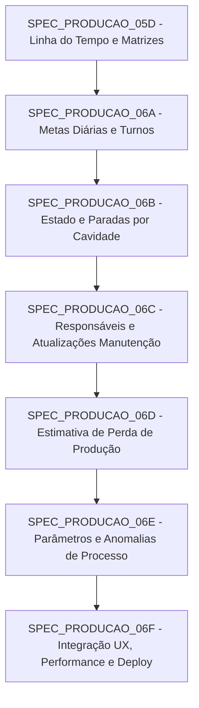

# 🗺️ ÍNDICE SEQUENCIAL DAS SPECs DE EVOLUÇÃO DO MÓDULO DE PRODUÇÃO (06A - 06F)

---

## 📌 CONTEXTO GERAL
Este índice estabelece a arquitetura modular, sequencial e segura para a implementação das novas demandas do app `production` e sua integração com o app `maintenance` e o supervisorio **Scada-LTS**.

---

## 🔗 SEQUÊNCIA DE EXECUÇÃO E DEPENDÊNCIAS

---

## 📋 RESUMO DAS SPECs

| SPEC | Arquivo | Foco Principal | Models Afetados | Migration |
| :--- | :--- | :--- | :--- | :--- |
| **06A** | [SPEC_PRODUCAO_06A_METAS_DIARIAS_E_TURNOS.md](file:///c:/Users/Unicompo/Documents/03_PYTHON1/07%20-%20Painel%20Manutencao/regras_programacao/SPEC_PRODUCAO_06A_METAS_DIARIAS_E_TURNOS.md) | Gestão de turnos administráveis no Django Admin e distribuição de meta diária/turno. | `ProductionShift`, `ProductionCavityConfig` | `0008` |
| **06B** | [SPEC_PRODUCAO_06B_ESTADO_E_PARADAS_POR_CAVIDADE.md](file:///c:/Users/Unicompo/Documents/03_PYTHON1/07%20-%20Painel%20Manutencao/regras_programacao/SPEC_PRODUCAO_06B_ESTADO_E_PARADAS_POR_CAVIDADE.md) | Indicador global e rastreamento relacional de estado/eventos por cavidade. | `ProductionCavityState`, `ProductionCavityDowntimeEvent` | `0009` |
| **06C** | [SPEC_PRODUCAO_06C_RESPONSAVEIS_E_ATUALIZACOES_MANUTENCAO.md](file:///c:/Users/Unicompo/Documents/03_PYTHON1/07%20-%20Painel%20Manutencao/regras_programacao/SPEC_PRODUCAO_06C_RESPONSAVEIS_E_ATUALIZACOES_MANUTENCAO.md) | Vínculo de técnicos da Manutenção e histórico imutável de atualizações parciais do reparo. | `maintenance.AllocationProgressUpdate` | `maintenance.0013` |
| **06D** | [SPEC_PRODUCAO_06D_ESTIMATIVA_PERDA_PRODUCAO.md](file:///c:/Users/Unicompo/Documents/03_PYTHON1/07%20-%20Painel%20Manutencao/regras_programacao/SPEC_PRODUCAO_06D_ESTIMATIVA_PERDA_PRODUCAO.md) | Cálculo de taxa de pneus/hora e estimativa agregada de perda de pneus por parada. | `ProductionRateAggregate` | `0010` |
| **06E** | [SPEC_PRODUCAO_06E_PARAMETROS_E_ANOMALIAS_PROCESSO.md](file:///c:/Users/Unicompo/Documents/03_PYTHON1/07%20-%20Painel%20Manutencao/regras_programacao/SPEC_PRODUCAO_06E_PARAMETROS_E_ANOMALIAS_PROCESSO.md) | Limites min/máx, tolerância, histerese e registro de anomalias operacionais. | `ProductionParameterConfig`, `ProductionParameterAnomalyEvent` | `0011` |
| **06F** | [SPEC_PRODUCAO_06F_INTEGRACAO_UX_PERFORMANCE_DEPLOY.md](file:///c:/Users/Unicompo/Documents/03_PYTHON1/07%20-%20Painel%20Manutencao/regras_programacao/SPEC_PRODUCAO_06F_INTEGRACAO_UX_PERFORMANCE_DEPLOY.md) | Rota e tela completa de detalhe da cavidade, otimização N+1, hardening e deploy. | N/A (Apenas Views/Templates) | Nenhuma |

---

## 🚨 REGRAS GERAIS DE EXECUÇÃO
1. Executar rigorosamente **uma SPEC por vez**, em conversas isoladas do agente antg.
2. Cada SPEC exige validação completa da suíte de testes (`manage.py test`) antes de considerar concluída.
3. Leitura do Scada-LTS é **100% somente leitura via MySQL**; escritas e estados ocorrem exclusivamente no banco `default`.
4. O intervalo do coletor em produção deve permanecer fixado em 60 segundos (`collect_production_scada --interval 60`).
