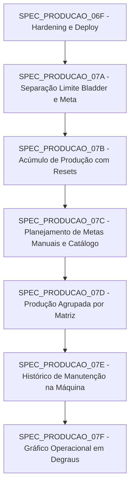

# 🗺️ ÍNDICE SEQUENCIAL DAS SPECs DA FASE 07 — EVOLUÇÃO E CONSOLIDAÇÃO DO MÓDULO DE PRODUÇÃO (07A - 07F)

---

## 📌 CONTEXTO GERAL
Este índice estabelece a arquitetura modular, a ordem sequencial estrita de execução e o plano detalhado de implementação para a Fase 07 do app `production`, cobrindo:
1. Separação conceitual e visual entre o limite do bladder (Scada) e as metas de produção (Manual/PCP).
2. Cálculo de produção acumulada por turno imune a resets de contadores do Scada e trocas de molde/bladder.
3. Área protegida de planejamento e gestão de metas manuais por turno, data, matriz e produto.
4. Resumo de produção agrupada por tipo de matriz com normalização de aliases.
5. Histórico em tempo real e somente leitura de atendimentos da Manutenção dentro da visão de máquina.
6. Novo gráfico operacional de estados em degraus (Step-line Chart) responsivo com eixos semânticos e presets temporais.

---

## 🔗 SEQUÊNCIA DE EXECUÇÃO E DEPENDÊNCIAS

---

## 📋 RESUMO DAS SPECs

| SPEC | Arquivo | Foco Principal | Models Afetados | Migration |
| :--- | :--- | :--- | :--- | :--- |
| **07A** | [SPEC_PRODUCAO_07A_SEPARACAO_LIMITE_BLADDER_E_META.md](file:///c:/Users/Unicompo/Documents/03_PYTHON1/07%20-%20Painel%20Manutencao/regras_programacao/SPEC_PRODUCAO_07A_SEPARACAO_LIMITE_BLADDER_E_META.md) | Separação formal de Limite do Bladder vs. Contador de Ciclo vs. Produção Acumulada vs. Meta Manual. | `ProductionCavityConfig` (metadados/labels) | `0012` |
| **07B** | [SPEC_PRODUCAO_07B_ACUMULO_PRODUCAO_COM_RESETS.md](file:///c:/Users/Unicompo/Documents/03_PYTHON1/07%20-%20Painel%20Manutencao/regras_programacao/SPEC_PRODUCAO_07B_ACUMULO_PRODUCAO_COM_RESETS.md) | Coletor com cálculo incremental, fechamento de ciclos de produção e preservação de totais em resets. | `ProductionCycle` [NEW], `ProductionShiftAccumulated` [NEW] | `0013` |
| **07C** | [SPEC_PRODUCAO_07C_PLANEJAMENTO_METAS_PRODUCAO.md](file:///c:/Users/Unicompo/Documents/03_PYTHON1/07%20-%20Painel%20Manutencao/regras_programacao/SPEC_PRODUCAO_07C_PLANEJAMENTO_METAS_PRODUCAO.md) | Área de cadastro de metas manuais por Líder/PCP com suporte a matrizes não instaladas e catálogo local. | `ProductionTarget` [NEW], `ProductionMatrixCatalog` [NEW] | `0014` |
| **07D** | [SPEC_PRODUCAO_07D_PRODUCAO_AGRUPADA_POR_MATRIZ.md](file:///c:/Users/Unicompo/Documents/03_PYTHON1/07%20-%20Painel%20Manutencao/regras_programacao/SPEC_PRODUCAO_07D_PRODUCAO_AGRUPADA_POR_MATRIZ.md) | Agrupamento analítico da produção acumulada por matriz com normalização de códigos/aliases. | N/A (Consulta e agregação em Views/Services) | Nenhuma |
| **07E** | [SPEC_PRODUCAO_07E_HISTORICO_MANUTENCAO_NA_MAQUINA.md](file:///c:/Users/Unicompo/Documents/03_PYTHON1/07%20-%20Painel%20Manutencao/regras_programacao/SPEC_PRODUCAO_07E_HISTORICO_MANUTENCAO_NA_MAQUINA.md) | Visão em tempo real e somente leitura de histórico de ordens/atendimentos de manutenção na tela da máquina. | N/A (Reutilização de `maintenance.Allocation`, `HistoricoPausa`, etc.) | Nenhuma |
| **07F** | [SPEC_PRODUCAO_07F_GRAFICO_ESTADOS_OPERACIONAIS.md](file:///c:/Users/Unicompo/Documents/03_PYTHON1/07%20-%20Painel%20Manutencao/regras_programacao/SPEC_PRODUCAO_07F_GRAFICO_ESTADOS_OPERACIONAIS.md) | Substituição da barra temporal por gráfico em degraus (Step-line Chart) responsivo em Chart.js com presets. | N/A (Frontend/Services) | Nenhuma |

---

## 🚨 REGRAS GERAIS DE EXECUÇÃO
1. Executar rigorosamente **uma SPEC por vez**, aguardando aprovação humana antes de iniciar qualquer código funcional.
2. Nenhuma SPEC pode alterar código ou criar migrations sem antes validar que a suíte completa de testes (`manage.py test`) está passando 100%.
3. O Scada-LTS permanece **100% somente leitura via MySQL secundário (`scada`)**; escrita, ciclos e acúmulos ocorrem no banco `default`.
4. O coletor de produção deve continuar utilizando a trava cross-process `scada_collector.lock` para evitar execuções concorrentes.
